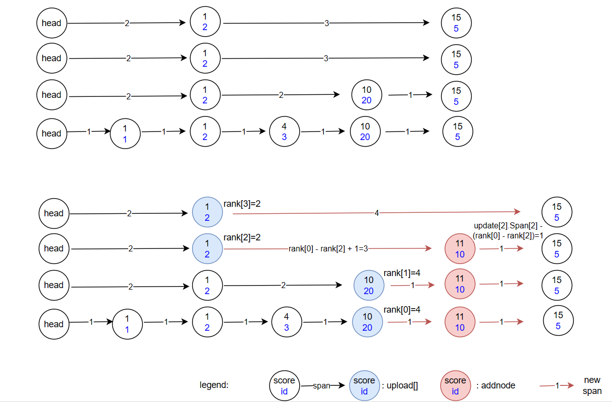

using a skip list to sort customers 
* span: the distance between one node and the subsequent node in the list. 
* update[i] : the node before the inserted node at the i-th level
* rank[i] : the rank of the customer. When adding a new customer, you only need to record the rank[i] for each update[i] 
* backward : in the diagram , I forgot to draw the backward pointer on the lowest level.
*  ps: I've sorted scores from low to high in the picture, which is a mistake.  However, the scores in my code are sorted correctly from high to low. The insertion process was the same for both.

as part of the skip list's update process.

The webapi can work now. There are many areas that need improvement, such as thread safety(using ReaderWriterLockSlim ) , some warnings and handling exceptions. I'm working on it.
